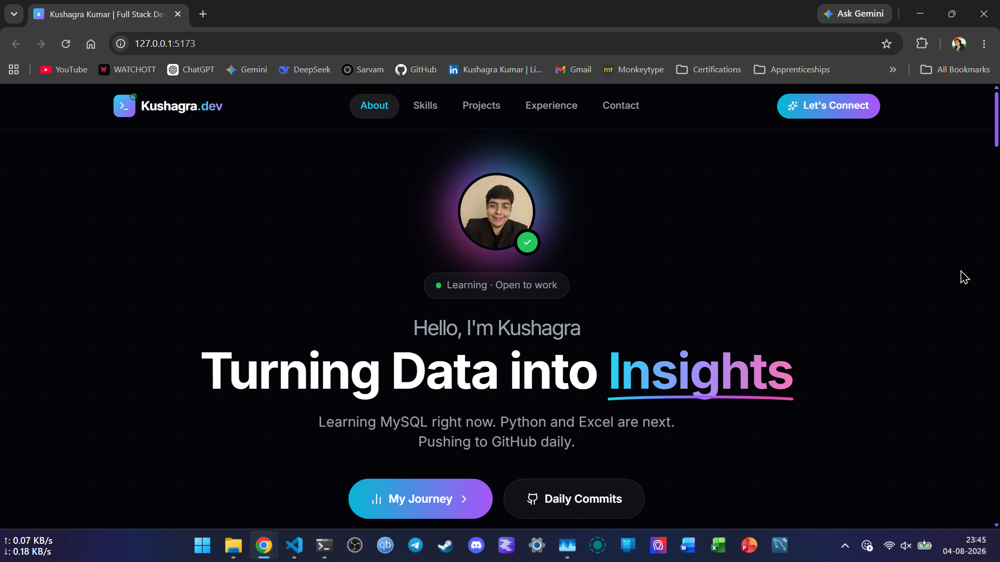
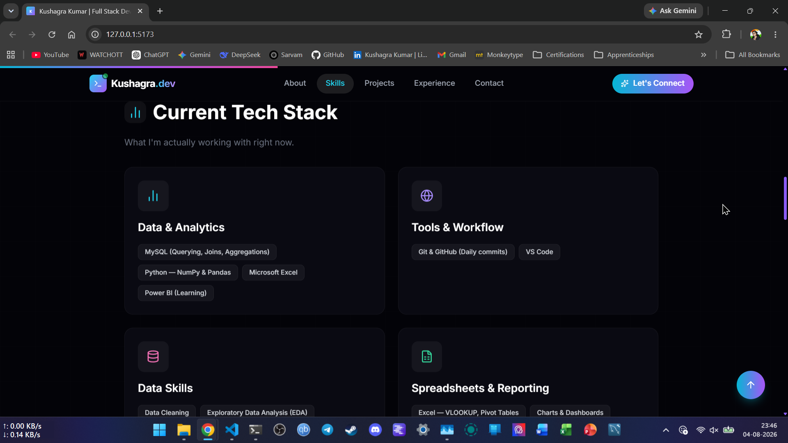
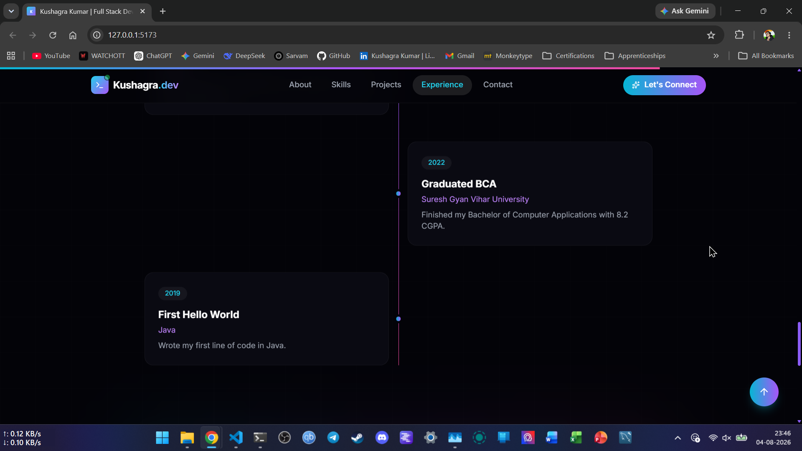
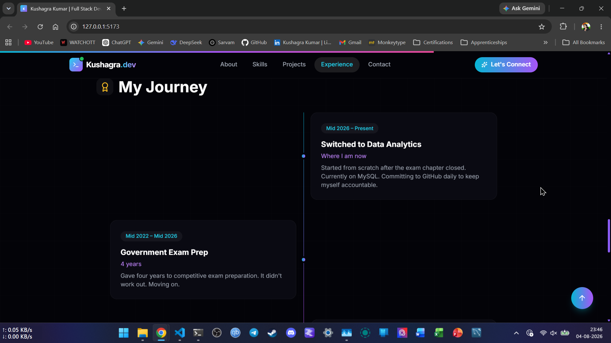
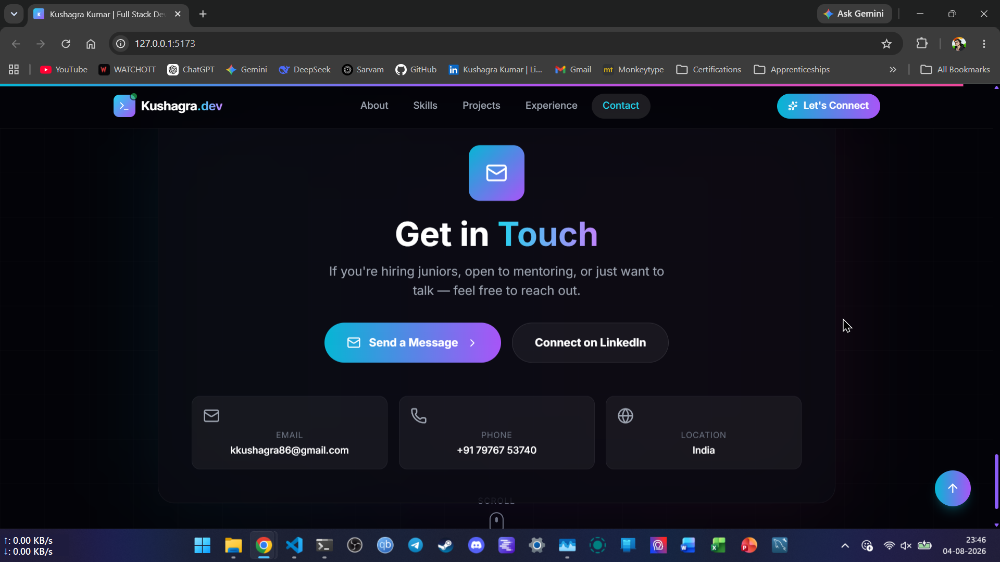

# Kushagra Kumar | Portfolio

Personal portfolio website built with React and Vite.

## About

I'm Kushagra Kumar, a BCA graduate.

After graduating in 2022, I spent roughly four years preparing for government examinations. When that path didn't work out, I decided to transition into tech and build a career in Data Analytics, with the long-term goal of progressing into Data Engineering, Data Science, and AI/ML.

I'm currently building my foundations through structured learning, hands-on practice, and projects, while documenting my progress on GitHub.

## Current Focus

I'm currently working through Data Analytics, starting with:

- MySQL
- Excel
- Power BI
- Python for Data Analysis

MySQL coursework is complete, and I'm currently revising the concepts before building projects with them.

You can follow my learning progress in my [AI/ML Journey](https://github.com/Kk376/ai-ml-journey) repository.

## Tech Stack

This portfolio is built with:

- **Framework:** React + Vite
- **Styling:** Tailwind CSS
- **Animations:** Framer Motion
- **Icons:** Lucide React

## Screenshots

### Home



### Skills



### Journey




### Contact



## What's on the Site

- **About:** Background and current career direction
- **Skills:** Technologies and tools I'm currently working with
- **Projects:** Projects completed throughout my learning journey
- **Journey:** My path from graduating with a BCA in 2022 to transitioning into Data Analytics
- **Contact:** Ways to connect with me

## Running Locally

Clone the repository:

```bash
git clone https://github.com/Kk376/Portfolio.git
cd Portfolio
pnpm install
pnpm run dev
