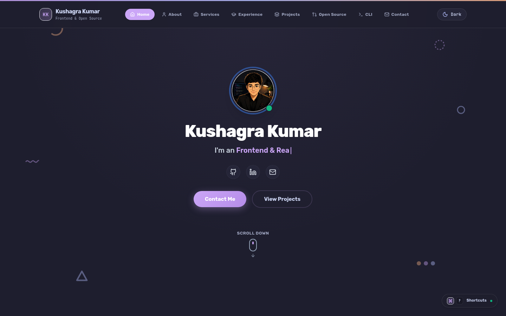

# Kushagra Kumar | Portfolio

A modern, fast, and accessible developer portfolio built with React 19, TypeScript, and Tailwind CSS. Showcases frontend engineering, Linux systems tooling, and real upstream open-source contributions landed with AI pair-programming.


*Catppuccin Mocha (Dark Mode)*


*Catppuccin Latte (Light Mode)*

---

## Inspiration and Credits

Initial layout and design inspiration originated from [Emma Bostian](https://github.com/emmabostian) ([@emmabostian](https://github.com/emmabostian)) and her open-source project [developer-portfolios](https://github.com/emmabostian/developer-portfolios). The design was then completely rebuilt and evolved into this custom React 19 and Tailwind CSS architecture with Catppuccin theming, interactive system telemetry, and custom terminal components.

---

## Key Features

- **Catppuccin Dual Theming**: Instant switching between Catppuccin Mocha (dark) and Catppuccin Latte (light) palettes. Includes zero-flash theme persistence in `localStorage`, system preference detection, and deterministic URL parameter overrides (`?theme=dark`, `?theme=light`).
- **Interactive System Telemetry**: Dual-mode hardware and environment inspector inspired by `kkfetch`. Switch seamlessly between structured system specification tiles and an interactive terminal view with zero layout shifting.
- **Upstream Open Source Showcase**: Production dispatches documenting real-world pull requests, merge requests, and bug reports across Cesium (`cesium-terrain-builder`), Mission Center (GitLab), and Zed editor. Features transparent AI pair-programming documentation and direct links to live repositories.
- **Global Keyboard Command Palette**: Fast keyboard navigation via `Cmd + K` or `Ctrl + K`. Quickly jump between sections, toggle themes, open GitHub repositories, or trigger shortcuts.
- **Serverless Contact Form**: Direct message delivery powered by Web3Forms with bot-trap honeypot security, client-side input validation, and automatic mailto fallback.
- **Engineered for Performance**: Built with React 19 hooks, memoized contexts, zero dead code, strict TypeScript types, sub-second production builds, and zero lint warnings.

---

## Tech Stack

| Layer | Technology |
| :--- | :--- |
| Framework | [React 19](https://react.dev/) |
| Language | [TypeScript 5](https://www.typescriptlang.org/) (Strict Mode) |
| Styling | [Tailwind CSS v3](https://tailwindcss.com/) |
| Icons | [Lucide React](https://lucide.dev/) |
| Build Tool | [Vite 8](https://vitejs.dev/) |
| Linter | [Oxlint](https://oxc.rs/) |
| Test Runner | [Vitest](https://vitest.dev/) (with JSDOM) |
| Forms | [Web3Forms API](https://web3forms.com/) |

---

## Project Structure

```
portfolio/
├── .github/
│   └── workflows/ci.yml       # Automated CI lint, test, and build pipeline
├── public/
│   └── favicon.svg            # Minimal geometric SVG favicon
├── screenshots/
│   ├── portfolio-dark.png     # Dark mode application preview
│   └── portfolio-light.png    # Light mode application preview
├── src/
│   ├── assets/                # Static media and avatar images
│   ├── components/            # Focused, accessible UI components
│   │   ├── AboutSection.tsx   # Bio, technical focus, and skills
│   │   ├── ContactSection.tsx # Web3Forms contact form with honeypot
│   │   ├── Footer.tsx         # Quick links and social channels
│   │   ├── HeroSection.tsx    # Hero headline, avatar, and quick CTAs
│   │   ├── Navbar.tsx         # Sticky header with theme toggle
│   │   ├── ProjectsSection.tsx# Flagship project cards
│   │   ├── ResumeSection.tsx  # Interactive journey and milestone timeline
│   │   ├── ServicesSection.tsx# Services and skill focus cards
│   │   ├── ShortcutsModal.tsx # Global keyboard shortcut palette
│   │   ├── SkillsSection.tsx  # Infinite marquee skills rail
│   │   ├── SystemTelemetry.tsx# Hardware inspector and terminal
│   │   └── UpstreamSection.tsx# Upstream contributions and bug reports
│   ├── context/               # Theme and application state providers
│   ├── data/                  # Strongly typed portfolio content and metadata
│   ├── hooks/                 # Custom keyboard and viewport hooks
│   ├── types/                 # Strict TypeScript interface definitions
│   ├── App.tsx                # Top-level composition and toast container
│   ├── index.css              # Custom Tailwind utilities and animations
│   └── main.tsx               # Application bootstrap entry point
├── .env.example               # Environment variable documentation
├── package.json               # Project dependencies and script runner
├── tsconfig.json              # Strict TypeScript compiler options
└── vite.config.ts             # Vite configuration and test setup
```

---

## Getting Started

### Prerequisites

- Node.js 22+ (LTS recommended)
- [pnpm](https://pnpm.io/) 9+

### Installation

```bash
# Clone the repository
git clone git@github.com:kk376/portfolio.git
cd portfolio

# Install dependencies
pnpm install
```

### Environment Configuration

Copy the example environment file and configure your Web3Forms access key:

```bash
cp .env.example .env.local
```

Edit `.env.local`:

```env
VITE_WEB3FORMS_KEY=your_access_key_here
```

*Note: If `VITE_WEB3FORMS_KEY` is omitted, the contact form automatically falls back to an accessible `mailto:` client trigger.*

### Development Scripts

```bash
# Start local development server on http://localhost:5173
pnpm dev

# Run unit tests via Vitest
pnpm test

# Run Oxlint for fast, zero-warning code inspection
pnpm lint

# Perform strict TypeScript check and production bundle build
pnpm build

# Preview production build locally on http://localhost:4173
pnpm preview
```

---

## Continuous Integration

Every push and pull request is automatically verified by GitHub Actions (`.github/workflows/ci.yml`):
1. Dependency integrity check via `pnpm install --frozen-lockfile`
2. Static analysis and code linting via `pnpm lint`
3. Full unit and component test suite execution via `pnpm test`
4. Strict TypeScript compilation and Vite production build via `pnpm build`

---

## License & Attribution

This portfolio is source-available under a custom [Personal Identity License](LICENSE).

- **Inspection & Learning**: You are welcome to view, study, and draw architectural inspiration from this codebase.
- **Identity Protection**: Direct 1:1 redeployment, commercial distribution, template cloning, or impersonating personal project narratives and credentials is strictly prohibited.
- **Inspiration**: If you build upon ideas or interaction patterns found here, please build your own authentic identity and provide attribution to original creators.

